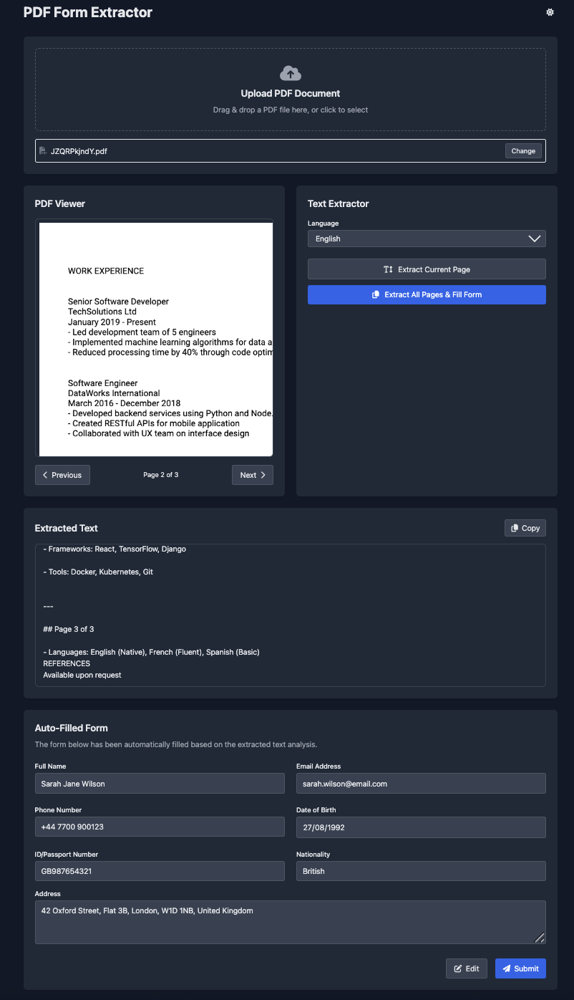

# PDF Form Extractor

A web application that extracts text from PDF documents using OCR, analyzes the content with OpenAI, and automatically fills a form with the extracted information.



## Features

- PDF document upload and viewing
- Page navigation for multi-page PDFs
- Text extraction using Tesseract.js OCR
- Multiple language support for OCR
- OpenAI integration for intelligent data extraction
- Automatic form filling based on extracted data
- Progress visualization during processing

## Getting Started

### Prerequisites

- A modern web browser (Chrome, Firefox, Safari, or Edge)
- Node.js (optional, for running with npx)
- Python (optional, for running with Python's HTTP server)
- OpenAI API key (for the AI-based form filling feature)

### Running Locally

1. Clone this repository or download the `index.html` file.

2. Navigate to the directory containing the file in your terminal.

3. Start a local server using one of these methods:

   **Option 1: Using Node.js and npx:**
   ```bash
   npx http-server -p 8000
   ```

   **Option 2: Using Python:**
   ```bash
   # For Python 3
   python -m http.server 8000

   # For Python 2
   python -m SimpleHTTPServer 8000
   ```

4. Open your web browser and navigate to:
   ```
   http://localhost:8000
   ```

5. Upload a PDF file, then use the "Extract All Pages & Fill Form" button.

6. Enter your OpenAI API key when prompted (or use the built-in mock data if you don't have a key).

## Code Structure

The application is built as a single HTML file with embedded JavaScript for simplicity of deployment.

### Main Components

- **File Upload**: Handles PDF file selection via drag-and-drop or file picker
- **PDF Viewer**: Renders and displays PDF pages using PDF.js
- **Text Extractor**: Extracts text from PDF pages using Tesseract.js OCR
- **API Integration**: Sends extracted text to OpenAI for analysis
- **Form Display**: Shows and populates the form with extracted data

### Key JavaScript Objects

- `state`: Manages the application state (current file, page, extraction status, etc.)
- `elements`: References to DOM elements for easy access
- `functions`: Core functionality including PDF loading, text extraction, and API calls

### Processing Flow

1. User uploads a PDF file
2. PDF is rendered and displayed in the viewer
3. User clicks "Extract All Pages & Fill Form"
4. Application prompts for OpenAI API key
5. Each page is processed sequentially with OCR
6. Combined text is sent to OpenAI for analysis
7. OpenAI extracts structured information
8. Form is populated with the extracted data

## Customizing for Different Use Cases

### Modifying the Form Structure

To adapt the form for different data collection needs:

1. Locate the form HTML in the `<div id="formCard">` section.
2. Add, remove, or modify form fields as needed.
3. Update corresponding JavaScript in the `fillFormWithData()` function to correctly map data to your fields.

Example of adding a new field for "Company Name":

```html
<!-- In the form HTML -->
<div>
  <label for="company" class="block text-sm font-medium mb-1">Company Name</label>
  <input type="text" id="company" name="company" class="w-full px-3 py-2 bg-white dark:bg-gray-700 border border-gray-300 dark:border-gray-600 rounded focus:outline-none focus:ring-2 focus:ring-blue-500">
</div>

<!-- Then in fillFormWithData function -->
document.getElementById('company').value = data.company || '';
```

### Customizing OpenAI Data Extraction

To change what information is extracted, modify the OpenAI API call in the `callOpenAI()` function:

1. Find the `functions` array in the `requestData` object.
2. Edit the `parameters.properties` object to define the data structure you want to extract.
3. Update the prompt in the `messages` array if needed for specific extraction instructions.

Example for extracting job application information:

```javascript
functions: [
  {
    name: "extract_application_info",
    description: "Extract job application information from document text",
    parameters: {
      type: "object",
      properties: {
        name: {
          type: "string",
          description: "Applicant's full name"
        },
        email: {
          type: "string",
          description: "Email address"
        },
        // New fields
        position: {
          type: "string",
          description: "Position applied for"
        },
        experience: {
          type: "number",
          description: "Years of experience"
        },
        skills: {
          type: "array",
          items: {
            type: "string"
          },
          description: "List of professional skills"
        },
        education: {
          type: "string",
          description: "Educational background"
        }
      },
      required: ["name", "email"]
    }
  }
]
```

### Using with Different Document Types

While primarily designed for forms and CVs/resumes, you can adapt for other documents by:

1. Adjusting the OCR settings in the `extractText()` and `extractAllPages()` functions
2. Modifying the OpenAI prompt to be more specific about the content type
3. Updating the OpenAI function parameters to match the expected document structure

## License

This project is licensed under the MIT License - see the LICENSE file for details.

## Acknowledgments

- [PDF.js](https://mozilla.github.io/pdf.js/) - PDF rendering
- [Tesseract.js](https://tesseract.projectnaptha.com/) - OCR capabilities
- [Tailwind CSS](https://tailwindcss.com/) - Styling
- [OpenAI](https://openai.com/) - AI-powered text analysis